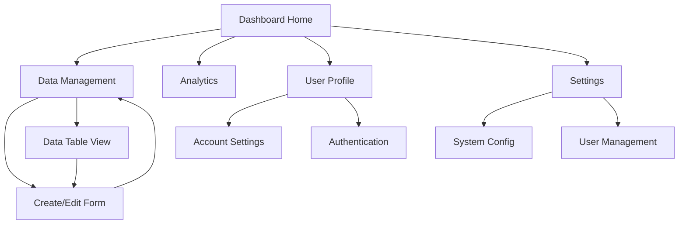

# Product Requirements Document - Serverless CRUD Dashboard Application

## 1. Product Overview
A modern full-stack serverless CRUD application featuring a responsive React dashboard that connects to AWS serverless backend services. The application provides comprehensive data management capabilities through an intuitive, professional dashboard interface built with shadcn/ui components.

The product solves the need for rapid development and deployment of data management applications without server maintenance overhead, targeting developers and businesses requiring scalable CRUD operations with modern UI/UX.

## 2. Core Features

### 2.1 User Roles
| Role | Registration Method | Core Permissions |
|------|---------------------|------------------|
| Admin User | Email registration with admin privileges | Full CRUD access, user management, system configuration |
| Regular User | Email registration | Read and limited write access to personal data |
| Guest User | No registration required | Read-only access to public data |

### 2.2 Feature Module
Our serverless CRUD dashboard application consists of the following main pages:
1. **Dashboard Home**: Overview metrics, recent activities, quick action cards, navigation sidebar
2. **Data Management**: CRUD operations interface, data table with filtering, search functionality
3. **Create/Edit Form**: Dynamic form for creating and editing records, validation, file upload support
4. **User Profile**: User account settings, preferences, authentication management
5. **Analytics**: Data visualization, charts, reporting dashboard
6. **Settings**: Application configuration, user management, system preferences

### 2.3 Page Details
| Page Name | Module Name | Feature description |
|-----------|-------------|---------------------|
| Dashboard Home | Navigation Sidebar | Collapsible sidebar with menu items, user profile section, theme toggle |
| Dashboard Home | Metrics Overview | Display key performance indicators, statistics cards, trend indicators |
| Dashboard Home | Recent Activities | List recent CRUD operations, activity timeline, quick filters |
| Dashboard Home | Quick Actions | Create new record button, import/export data, bulk operations |
| Data Management | Data Table | Paginated table with sorting, filtering, search, column customization |
| Data Management | CRUD Operations | Create, read, update, delete records with confirmation dialogs |
| Data Management | Bulk Actions | Select multiple records, bulk delete, bulk edit, export selected |
| Create/Edit Form | Dynamic Form | Auto-generated forms based on data schema, field validation |
| Create/Edit Form | File Upload | Drag-and-drop file upload, image preview, file type validation |
| Create/Edit Form | Form Validation | Real-time validation, error messages, required field indicators |
| User Profile | Account Settings | Update profile information, change password, email preferences |
| User Profile | Authentication | Login/logout functionality, session management, password reset |
| Analytics | Data Visualization | Charts and graphs showing data trends, interactive dashboards |
| Analytics | Reporting | Generate reports, export data, scheduled reports |
| Settings | System Configuration | Application settings, API configuration, feature toggles |
| Settings | User Management | Manage user roles, permissions, user activity monitoring |

## 3. Core Process
**Admin User Flow:**
Admin users can access all features starting from the dashboard home, navigate to data management for full CRUD operations, create detailed reports in analytics, and manage system settings and users.

**Regular User Flow:**
Regular users log in to view their dashboard, access limited data management features for their own records, update their profile settings, and view basic analytics related to their data.

**Guest User Flow:**
Guest users can browse public data in read-only mode, view basic analytics dashboards, and access registration/login pages to create an account.

## 4. User Interface Design
### 4.1 Design Style
- **Primary Colors**: Blue (#3b82f6), Dark Blue (#1e40af)
- **Secondary Colors**: Gray (#6b7280), Light Gray (#f3f4f6), White (#ffffff)
- **Button Style**: Rounded corners (8px), subtle shadows, hover animations
- **Font**: Inter font family, 14px base size, 16px for headings
- **Layout Style**: Card-based design, left sidebar navigation, clean spacing
- **Icons**: Lucide React icons, consistent 20px size, outlined style

### 4.2 Page Design Overview
| Page Name | Module Name | UI Elements |
|-----------|-------------|-------------|
| Dashboard Home | Navigation Sidebar | Fixed left sidebar, 240px width, collapsible, dark theme with blue accents |
| Dashboard Home | Metrics Cards | Grid layout, white cards with subtle shadows, colored accent borders |
| Dashboard Home | Activity Feed | Vertical timeline, avatar icons, relative timestamps, hover effects |
| Data Management | Data Table | Striped rows, sortable headers, pagination controls, action buttons |
| Data Management | Search/Filter | Top-aligned search bar, dropdown filters, clear filters button |
| Create/Edit Form | Form Layout | Two-column responsive layout, grouped sections, progress indicators |
| Create/Edit Form | Input Fields | Consistent styling, floating labels, validation states (error/success) |
| User Profile | Profile Card | Centered card layout, avatar upload, tabbed sections |
| Analytics | Chart Container | Full-width responsive charts, legend, interactive tooltips |
| Settings | Settings Panel | Accordion-style sections, toggle switches, save/cancel buttons |

### 4.3 Responsiveness
The application is desktop-first with mobile-adaptive design. Touch interaction optimization is implemented for mobile devices with larger touch targets, swipe gestures for navigation, and collapsible sidebar for smaller screens. Breakpoints: Mobile (320px-768px), Tablet (768px-1024px), Desktop (1024px+), Large Desktop (1440px+).