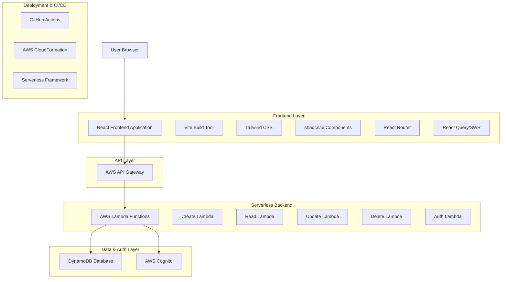
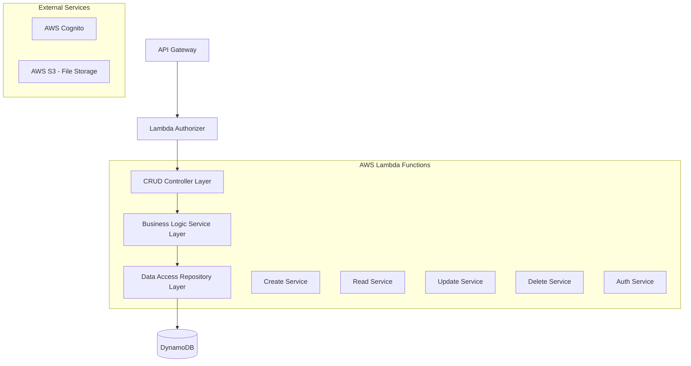
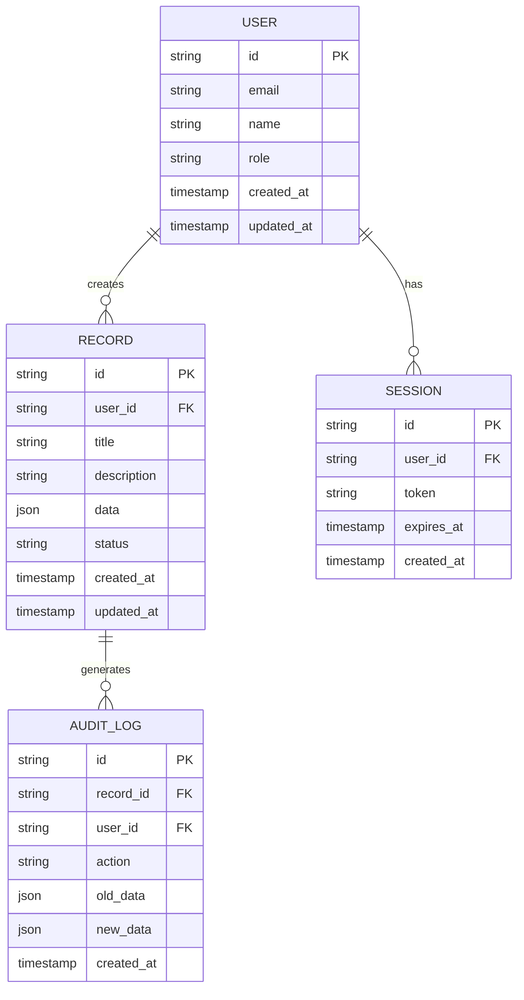

# Technical Architecture Document - Serverless CRUD Dashboard Application

## 1. Architecture Design



## 2. Technology Description
- Frontend: React@18 + Vite@5 + TypeScript + Tailwind CSS@3 + shadcn/ui + React Router@6 + React Query@4
- Backend: Serverless Framework + AWS Lambda (Node.js) + AWS API Gateway
- Database: AWS DynamoDB
- Authentication: AWS Cognito
- Deployment: GitHub Actions + Serverless Framework

## 3. Route Definitions
| Route | Purpose |
|-------|---------|
| / | Dashboard home page with metrics and navigation |
| /dashboard | Main dashboard with overview and quick actions |
| /data | Data management page with CRUD operations table |
| /data/create | Create new record form page |
| /data/edit/:id | Edit existing record form page |
| /data/:id | View single record details page |
| /analytics | Analytics dashboard with charts and reports |
| /profile | User profile and account settings page |
| /settings | Application settings and configuration |
| /login | User authentication login page |
| /register | User registration page |
| /forgot-password | Password reset page |

## 4. API Definitions

### 4.1 Core API

**Authentication Endpoints**
```
POST /api/auth/login
POST /api/auth/register
POST /api/auth/logout
POST /api/auth/refresh
POST /api/auth/forgot-password
```

**CRUD Operations**
```
GET /api/records
POST /api/records
GET /api/records/:id
PUT /api/records/:id
DELETE /api/records/:id
```

**User Management**
```
GET /api/users/profile
PUT /api/users/profile
GET /api/users/:id
```

**Analytics**
```
GET /api/analytics/dashboard
GET /api/analytics/reports
```

### Authentication Request/Response Example
```
POST /api/auth/login
```

Request:
| Param Name| Param Type  | isRequired  | Description |
|-----------|-------------|-------------|-------------|
| email     | string      | true        | User email address |
| password  | string      | true        | User password |

Response:
| Param Name| Param Type  | Description |
|-----------|-------------|-------------|
| success   | boolean     | Authentication status |
| token     | string      | JWT access token |
| user      | object      | User profile information |

Example Request:
```json
{
  "email": "user@example.com",
  "password": "securePassword123"
}
```

Example Response:
```json
{
  "success": true,
  "token": "eyJhbGciOiJIUzI1NiIsInR5cCI6IkpXVCJ9...",
  "user": {
    "id": "user-123",
    "email": "user@example.com",
    "name": "John Doe",
    "role": "user"
  }
}
```

## 5. Server Architecture Diagram



## 6. Data Model

### 6.1 Data Model Definition



### 6.2 Data Definition Language

**User Table (users)**
```sql
-- Create users table
CREATE TABLE users (
    id UUID PRIMARY KEY DEFAULT gen_random_uuid(),
    email VARCHAR(255) UNIQUE NOT NULL,
    name VARCHAR(100) NOT NULL,
    role VARCHAR(20) DEFAULT 'user' CHECK (role IN ('admin', 'user', 'guest')),
    created_at TIMESTAMP WITH TIME ZONE DEFAULT NOW(),
    updated_at TIMESTAMP WITH TIME ZONE DEFAULT NOW()
);

-- Create indexes
CREATE INDEX idx_users_email ON users(email);
CREATE INDEX idx_users_role ON users(role);
```

**Records Table (records)**
```sql
-- Create records table
CREATE TABLE records (
    id UUID PRIMARY KEY DEFAULT gen_random_uuid(),
    user_id UUID NOT NULL,
    title VARCHAR(255) NOT NULL,
    description TEXT,
    data JSONB,
    status VARCHAR(20) DEFAULT 'active' CHECK (status IN ('active', 'inactive', 'deleted')),
    created_at TIMESTAMP WITH TIME ZONE DEFAULT NOW(),
    updated_at TIMESTAMP WITH TIME ZONE DEFAULT NOW()
);

-- Create indexes
CREATE INDEX idx_records_user_id ON records(user_id);
CREATE INDEX idx_records_status ON records(status);
CREATE INDEX idx_records_created_at ON records(created_at DESC);
```

**Sessions Table (sessions)**
```sql
-- Create sessions table
CREATE TABLE sessions (
    id UUID PRIMARY KEY DEFAULT gen_random_uuid(),
    user_id UUID NOT NULL,
    token VARCHAR(500) NOT NULL,
    expires_at TIMESTAMP WITH TIME ZONE NOT NULL,
    created_at TIMESTAMP WITH TIME ZONE DEFAULT NOW()
);

-- Create indexes
CREATE INDEX idx_sessions_user_id ON sessions(user_id);
CREATE INDEX idx_sessions_token ON sessions(token);
CREATE INDEX idx_sessions_expires_at ON sessions(expires_at);
```

**Audit Log Table (audit_logs)**
```sql
-- Create audit_logs table
CREATE TABLE audit_logs (
    id UUID PRIMARY KEY DEFAULT gen_random_uuid(),
    record_id UUID,
    user_id UUID NOT NULL,
    action VARCHAR(50) NOT NULL,
    old_data JSONB,
    new_data JSONB,
    created_at TIMESTAMP WITH TIME ZONE DEFAULT NOW()
);

-- Create indexes
CREATE INDEX idx_audit_logs_record_id ON audit_logs(record_id);
CREATE INDEX idx_audit_logs_user_id ON audit_logs(user_id);
CREATE INDEX idx_audit_logs_created_at ON audit_logs(created_at DESC);
```

**Initial Data**
```sql
-- Insert sample users
INSERT INTO users (email, name, role) VALUES
('admin@example.com', 'Admin User', 'admin'),
('user@example.com', 'Regular User', 'user');

-- Insert sample records
INSERT INTO records (user_id, title, description, data, status) VALUES
((SELECT id FROM users WHERE email = 'admin@example.com'), 'Sample Record 1', 'This is a sample record', '{"category": "test", "priority": "high"}', 'active'),
((SELECT id FROM users WHERE email = 'user@example.com'), 'Sample Record 2', 'Another sample record', '{"category": "demo", "priority": "medium"}', 'active');
```